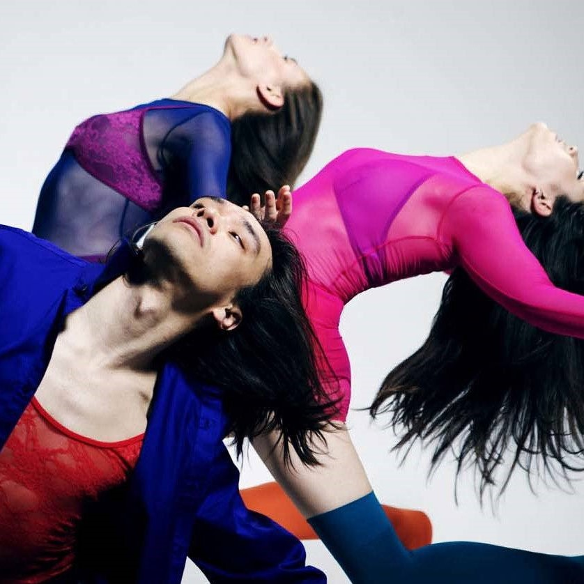

<!DOCTYPE html>
<html lang="en">
    <head>
        <title>Ksenia Portfolio</title>
        <meta charset="utf-8">
        <meta name="viewport" content="width=device-width, initial-scale=1, minimum-scale=1" />
        <link rel="stylesheet" href="./style.css">
        <link href='https://fonts.googleapis.com/css?family=Amita' rel='stylesheet'>
        <link href='https://fonts.googleapis.com/css?family=Beth Ellen' rel='stylesheet'>
        <link href='https://fonts.googleapis.com/css?family=Courgette' rel='stylesheet'>
        <link href="https://fonts.googleapis.com/css2?family=Antic+Didone&display=swap" rel="stylesheet">
        <link href="https://fonts.googleapis.com/css2?family=Arapey&display=swap" rel="stylesheet">
    </head>
    <body>
        

            

                <button>M</button>
            

            

                

                    KSENIA DRUZHININA
                

            

            

                <button>S</button>
            

        

        

            

                
            

            

                

                    About Me...
                

                

                    I like to dance and act and choreo and model
                    and dance and act and choreo and model and dance
                    and act and choreo and model and dance and act
                    and choreo and model...
                

            

        

        

                

                    

                        Dancer ->
                    

                    

                        
                    

                

                

                    

                        Choreographer ->
                    

                    

                        
                    

                

                

                    

                        Actor ->
                    

                    

                        
                    

                

                

                    

                        Model ->
                    

                    

                        
                    

                

        

        

            Footer
        

    </body>
</html>

html,body {
    width: 100%;
    height: 100%;
    margin: 0px;
    padding: 0px;
    overflow-x: hidden;
}

body {
    display: flex;
    flex-direction: column;
    min-height: 100vh;
}

.header {
    display: flex;
    justify-content: center;
    align-items: center;
    background-color: black;
}

.header-title {
    display: flex;
    flex: auto;
    justify-content: center;
    align-items: center;
    font-size: 32px;
    color: black;
}

.full-name {
    font-family: 'Arapey', 'arial';
    font-size: 25px;
    color: white;
    margin-bottom: -5px;
    margin-left: 2px;
    margin-right: 2px;
}

.header-left,
.header-right {
    margin: 15px;
}

.header-left button,
.header-right button {
    border-radius: 10px;
    background-color: rgb(173, 131, 76);
    color: white;
}

.banner img {
    width: 100%;
    height: auto;
    display: block;
}

.about {
    min-height: 30vh;
    display: flex;
    flex-direction: column;
    justify-content: flex-start;
    align-items: center;
    background-color: rgb(25, 85, 25);
}

.about-header {
    font-family: 'Beth Ellen', 'arial';
    margin: 15px;
    border-bottom: 1px solid white;
    color: white;
}

.about-text {
    width: 70vw;
    font-size: 16px;
    color: white;
    text-align: center;
    font-family: 'Amita';
    margin-bottom: 10px;
}

.content {
    display: flex;
    flex-direction: column;
    align-items: center;
    min-height: fit-content;
}

.dance,
.choreo,
.act,
.model {
    display: flex;
    width: 100%;
    flex-direction: column;
    padding: 10px;
    min-height: fit-content;
}

.dance {
    background-color: rgb(238, 87, 112);
    background-color: rgb(199, 226, 199);
}

.choreo {
    background-color: rebeccapurple;
    background-color: rgb(221, 212, 199);
}

.act {
    background-color: rgb(44, 44, 172);
    background-color: rgb(199, 226, 199);
}

.model {
    background-color: rgb(15, 10, 36);
    background-color: rgb(221, 212, 199);
}

.dance-header,
.choreo-header,
.act-header,
.model-header {
    margin-left: 10vw;
    padding: 10px;
    font-size: 25px;
    font-family: 'Beth Ellen';
}

.dance-header {
    color: rgb(72, 150, 72);
}

.choreo-header {
    color: rgb(201, 145, 73);
}

.act-header {
    color: rgb(72, 150, 72);
}

.model-header {
    color: rgb(201, 145, 73);
}

.dance-image,
.choreo-image,
.act-image,
.model-image {
    width: 100%;
    height: fit-content;
    background-color: inherit;
    margin: 20px;
    border-radius: 10px;
    display: flex;
    align-items: center;
    justify-content: center;
    font-size: 30px;
    margin-left: 0;
    margin-bottom: 6vh;
}

.dance-image img,
.choreo-image img,
.act-image img,
.model-image img {
    width: 70%;
    height: calc((width * 4) / 5);
    align-self: center;
}

.footer {
    background-color: white;
    padding: 10px;
}

